# MEMESCOPE Yellowstone gRPC / Geyser Discovery Readiness Audit

**Date:** 2026-08-16  
**Scope:** Read-only architecture and runtime audit. No production, scanner, Radar, Track Record, Paper Wallet, Real Wallet, configuration, data, or dependency changes were made.

## Executive conclusion

MEMESCOPE is a good candidate for a **parallel Yellowstone shadow stream**, but it is **not ready to make Yellowstone authoritative** yet.

The existing scanner already has the right broad separation: stream observation, pure parsing, idempotent persistence, Redis fan-out, and independent enrichment. A Yellowstone adapter can reuse almost all downstream work. The missing pieces are a common discovery-event boundary, durable per-source observation/provenance, durable replay checkpoints, and measurement of receipt/queue latency. Implement those first; keep the existing JSON-RPC WebSocket scanner canonical during shadow operation.

| Item | Assessment |
| --- | --- |
| Audit completion | **100%** of the requested read-only audit scope |
| Existing architecture readiness | **55%** |
| Safe shadow-mode readiness today | **Not ready without additive telemetry/checkpoint work** |
| Authoritative cutover readiness today | **No** |
| Recommended next phase | Parallel, non-authoritative shadow adapter only |
| Estimated implementation effort | **Medium–large:** roughly 8–12 engineering days including tests and an observation period |

This is not a recommendation to replace JSON-RPC, enable a wallet, or alter any trading decision. Yellowstone can improve the transport path, but it cannot make market-price availability, Radar qualification, or Paper Wallet logic faster by itself.

## 1. Current discovery architecture

```mermaid
flowchart LR
    RPC[Helius / standard Solana WebSocket]
    S[TokenScanner]
    Q[Bounded asyncio queue]
    P[Pure Pump.fun CreateEvent parser]
    F[getTransaction + optional getAsset fallback]
    D[(discovered_tokens)]
    R[Redis token-discovered channel]
    E[MarketEnrichmentWorker]
    M[(token_market_snapshots)]
    SC[Optional scoring]
    RA[Optional Radar refresh]
    RT[(radar_tokens / Track Record)]
    PW[Generation 6 Paper Wallet]

    RPC -->|logsSubscribe, confirmed| S --> Q
    Q --> P
    P -->|unparseable only| F
    P --> D
    F --> D --> R --> E --> M --> SC --> RA --> RT --> PW
```



### Scanner intake

- [`backend/app/services/scanner/scanner.py`](backend/app/services/scanner/scanner.py) owns the long-lived `TokenScanner` process. It uses standard Solana WebSocket JSON-RPC `logsSubscribe`, not polling, one subscription for every configured `SCANNER_WATCH_PROGRAMS` program.
- The active default Pump.fun program is `6EF8rrecthR5Dkzon8Nwu78hRvfCKubJ14M5uBEwF6P`, also exposed as `PUMPFUN_PROGRAM_ID` in [`backend/app/core/config.py`](backend/app/core/config.py).
- Current commitment is `confirmed`; the queue has a capacity of 2,000 and four workers. A full queue deliberately drops the newest event and logs it rather than growing memory without bound.
- The WebSocket uses a 20-second ping/timeout. Disconnects reconnect with full-jitter exponential backoff (1 second initial, 60 seconds maximum); reconnects are escalated after five consecutive failures and state is published to Redis with a 300-second TTL.
- The current process is intentionally one Compose replica. Recent runtime logs showed two brief `ConnectionClosedError` reconnects, both followed by a successful resubscription; there is no current stream replay or backfill after those reconnects.

### Parsing and resolution

- [`backend/app/services/scanner/parser.py`](backend/app/services/scanner/parser.py) first filters for SPL `InitializeMint` / `InitializeMint2` log markers.
- Its Pump.fun fast path decodes the existing anchored `CreateEvent` from `Program data:` log bytes using the pinned `CREATE_EVENT_DISCRINATOR`. It produces the mint, creator, name, symbol, URI, event timestamp, signature, and slot without an extra RPC request.
- If that event cannot be decoded, the scanner falls back to `getTransaction` (up to six attempts). The generic transaction parser finds an initialized mint from parsed instructions or token balance differences. Helius then optionally retries `getAsset` up to five times for metadata.
- The RPC query abstraction in [`backend/app/services/rpc/`](backend/app/services/rpc/) already supports standard JSON-RPC and Helius/DAS. It is an excellent abstraction for request/response chain reads, but is **not** a discovery-source abstraction.

### Persistence and deduplication

- [`backend/app/models/token.py`](backend/app/models/token.py) has one `discovered_tokens` record per `mint_address`; the database unique constraint is the definitive dedupe guarantee.
- [`backend/app/repositories/token.py`](backend/app/repositories/token.py) inserts with PostgreSQL `ON CONFLICT DO NOTHING`. Redis `SET NX` with a one-hour TTL (`scanner:seen:<mint>`) is only the cheap pre-check.
- `discovered_at` is a database server default, written by the first successful insert. It means **first time this system persisted the mint**, not chain creation time or a source receipt timestamp. A loser in a concurrent insert race neither updates it nor preserves alternate source provenance.
- `block_time` is populated from the direct Pump.fun event when available or the fallback transaction. `source_program`, signature, and slot are stored. There is no source type (`rpc_ws` versus `yellowstone`), provider-observed time, raw receipt time, or replay state column.
- After a committed insert the scanner publishes its payload to the Redis token channel. Redis is fan-out, not canonical storage; a missed publish does not erase the durable discovery row.

### Enrichment, Radar, Track Record, and Paper Wallet

- [`backend/app/services/market/worker.py`](backend/app/services/market/worker.py) listens to Redis for immediate registration and also runs a durable database backfill every 300 seconds. The backfill prevents a Redis outage or worker restart from orphaning a discovery.
- The enrichment loop claims due rows, calls the configured market-data provider in batches of 30 (worker claim batch 60), writes `token_market_snapshots`, then commits **before** score, Radar, Paper-position review, curve collection, or opportunity processing. Each later stage has its own failure boundary.
- Idle enrichment polling is every five seconds. Fresh tokens are normally scheduled at 30-second intervals, then 5 minutes, 30 minutes, and 6 hours by age. Empty provider results are not fabricated into prices.
- When enabled, the same committed snapshot batch triggers `RadarService.refresh_mints`. A qualifying first Radar detection creates an immutable `radar_tokens.first_detected_at` Track Record admission. The separate Pump.fun Radar task is a 15-minute, read-only candidate scan over already persisted discovery and market data; it is not a launch-discovery mechanism.
- Generation 6 uses `paper_track_record_tp125_sl50_v1`: after its watermark it reads immutable Track Record admissions, waits for the first usable post-admission observed market snapshot, then takes its fixed $10 paper entry. It does not consume raw scanner events directly. Its current strategy is 1.25x TP / 0.50x SL with no trailing or time exit. This audit does not alter it.
- Celery schedules Radar sweeps, Pump.fun candidate scans, and paper review every 15, 15, and 5 minutes respectively. Snapshot-driven Radar and held-position reviews provide earlier event-driven paths where their feature flags are enabled.

## 2. What controls discovery speed today

### Measured facts

The local database contained 162,726 discovery rows and 7,083,722 market snapshots at audit time. In the latest 24-hour window:

- 14,433 discovery rows were written.
- For rows with non-negative `discovered_at - block_time`, the chain-time-to-database distribution was p50 **1.65 s**, p95 **2.53 s**, p99 **4.59 s**.
- 121 of 14,431 rows with a `block_time` had a negative apparent latency, including multi-minute outliers. These come from the stored event/transaction timestamp path and make raw `block_time` unsuitable as an SLA clock without validation.
- 12,396 of the 14,433 discoveries had a later priced market snapshot; 2,037 did not yet have one. The discovery-to-first-priced-snapshot distribution was p50 **4,240 s**, p95 **35,130 s**, p99 **35,342 s**. This is primarily market/provider scheduling and market availability, not scanner delivery latency.
- Existing DexScreener snapshot records reported provider latency p50 **401 ms**, p95 **766 ms**, p99 **1,234 ms** for that window. Sampled live logs showed roughly 330–630 ms per request batch.

These figures measure persisted timestamps, not a full end-to-end transport trace. They should not be used as a promise that every token is detected in 1–5 seconds.

### Known bounds and unknowns

| Stage | Current behavior | What can be stated |
| --- | --- | --- |
| Chain notification | `logsSubscribe` at `confirmed` | No polling interval; provider/commitment latency is not separately recorded. |
| Scanner queue | 2,000 events, 4 workers | Queue wait is not timestamped. Under saturation, newest events are dropped. |
| Fast parsing | Local log decoding | No RPC round trip on a valid Pump.fun CreateEvent. Per-event duration is not stored. |
| Fallback parsing | `getTransaction`, then optional DAS metadata | Up to six and five retry attempts; worst case depends on retry/backoff and provider response. |
| Database write | One insert transaction | `discovered_at` is available, but receipt time is not. |
| Redis → enrichment | Immediate listener plus 300-second DB backfill | Normal fast path has no persisted latency; recovery can wait up to the backfill cadence. |
| First market price | Provider batch and adaptive refresh | Measured above; no price is fabricated if provider has no market. |

The main measured scanner-side bottleneck is therefore **not yet distinguishable** between chain/provider delivery, queue wait, parse/fallback, and database insert. Yellowstone should not be judged “faster” until those boundaries are instrumented for both sources.

## 3. Smallest clean Yellowstone integration point

Do **not** put Yellowstone into `SolanaRPC`; that interface is intentionally request/response and is used by scanner fallback, curve collection, and account fetching.

Introduce a small streaming boundary beside the scanner instead:

```text
DiscoveryProvider (async stream of normalized observations)
  ├── RpcWebSocketDiscoveryProvider
  └── YellowstoneDiscoveryProvider
                 ↓
DiscoveryIngestor
  → existing creation parser / RPC fallback
  → canonical discovered_tokens write (only when authoritative)
  → existing Redis publication
```

Suggested normalized observation fields:

```text
source                 # rpc_ws | yellowstone_grpc
provider_name
received_at            # MEMESCOPE wall clock, captured at socket receive
provider_created_at    # Yellowstone SubscribeUpdate.created_at, nullable
commitment
slot
signature
source_program
logs                   # normalized transaction meta log messages, when present
transaction_payload    # optional normalized/raw source payload for fallback
replay                 # bool
reconnect_generation
```

The ingestion service, not an adapter, should own parse/fallback, idempotent canonical write, and Redis publication. This keeps the rest of the pipeline unchanged and prevents two discovery implementations from slowly drifting in their handling of malformed transactions, metadata, and duplicates.

Yellowstone’s official protocol has a bidirectional `Subscribe` stream, transaction updates containing signature, transaction metadata and slot, and a server `created_at` timestamp. It also defines transaction filters and `from_slot`; use the pinned provider/protocol version rather than depending on the repository’s moving `master` branch. [Yellowstone proto](https://github.com/rpcpool/yellowstone-grpc/blob/master/yellowstone-grpc-proto/proto/geyser.proto)

## 4. Pump.fun subscription recommendation

### Initial subscription: transactions only

Use one `transactions` filter with:

```text
commitment: confirmed                 # match current scanner semantics
vote: false
failed: false
account_include: [6EF8rrecthR5Dkzon8Nwu78hRvfCKubJ14M5uBEwF6P]
```

This is the narrowest documented equivalent of the existing program-log subscription. Yellowstone documents `account_include` as matching transactions that use any listed account and allows `vote`/`failed` filtering. [Yellowstone transaction filters](https://github.com/rpcpool/yellowstone-grpc/blob/master/README.md#transactions)

For each returned transaction, normalize the signature, slot, status/meta logs, and configured program provenance into the existing `LogEvent` shape. Then retain the existing `InitializeMint` prefilter and `parse_create_event` decoder. If normalized metadata logs are absent or do not decode, retain the existing RPC `getTransaction` fallback; do not create a second guessed Pump.fun binary parser.

### Do not subscribe initially

- **All account updates:** not required by the existing creation detector and potentially much noisier. No existing bonding-curve account layout/discriminator parser establishes a safe account-level filter.
- **Blocks or entries:** unnecessary for one program-filtered creation stream and add reconstruction/volume complexity.
- **Instruction discriminators:** the repository establishes a `CreateEvent` discriminator in program logs, not a Pump.fun instruction layout. Do not invent one.
- **`SubscribeDeshred`:** it can arrive earlier, but its documented pre-execution data has no execution status, logs, inner instructions, balances, or `TransactionStatusMeta`; it cannot drive the existing confirmed/valid-create parser. Keep it out of canonical discovery and, if ever studied, use a separate research-only experiment. [Yellowstone deshred limitations](https://github.com/rpcpool/yellowstone-grpc/blob/master/README.md#deshred-transactions)
- **PumpSwap migration events:** no PumpSwap program ID or migration parser is currently established in the scanner. `pumpswap` appears in later venue/safety configuration, not in the discovery subscription/parser. Add it only after a separately verified program ID and parser are available.

## 5. Duplicate safety and timestamp semantics

Today, concurrent sources will still create only one `discovered_tokens` row because `mint_address` is unique. That protects Radar/Track Record/Paper Wallet from duplicate tokens. It is not enough for a shadow experiment because it destroys the losing source’s observation and makes “which source was first?” unknowable.

### Required additive model

Add a separate, append-only `discovery_observations` table before dual-source operation. It must not change historical `discovered_at` semantics.

| Field | Purpose |
| --- | --- |
| `id`, `mint_address`, `signature`, `slot` | Join keys and source event identity |
| `source`, `provider_name`, `commitment` | Provenance |
| `provider_created_at`, `received_at`, `persisted_at` | Distinguish provider time, local receipt, and durable write |
| `replay`, `reconnect_generation`, `checkpoint_slot` | Recovery audit trail |
| `parse_outcome`, `failure_reason` | Coverage and false-negative measurement |
| raw payload reference/hash, not unbounded payload | Debug correlation without uncontrolled database growth |

Use a unique key such as `(source, signature, mint_address)` for idempotent source observations. A single transaction can theoretically need careful treatment if a future parser permits more than one mint, so do not use mint alone for observation identity.

For a future authoritative dual-source phase, retain existing `discovered_at` as the original **first persisted canonical row**. Add a separate `first_observed_at` only if its trust rules are agreed in advance:

1. prefer a validated provider `created_at` from a confirmed transaction;
2. otherwise use MEMESCOPE’s source receipt timestamp;
3. update that additive value by `LEAST`, never overwrite the immutable historical meaning of `discovered_at`;
4. preserve all sources in provenance rather than letting the last writer rewrite metadata.

This gives exact dual-source evidence without creating duplicate Radar rows, Track Record admissions, or paper entries.

## 6. Shadow-mode design

### Rules

1. Existing JSON-RPC WebSocket discovery remains the **only canonical writer** to `discovered_tokens` and the only publisher to the token Redis channel.
2. Yellowstone parses and writes only `discovery_observations` plus health/metrics. It must never call `publish_token_discovered`, market enrichment, Radar, Track Record, Paper Wallet, or Real Wallet.
3. The comparison job joins observations by signature/mint first, then only uses slot as supporting evidence. It must distinguish same-slot events.
4. Dashboard/reporting is research-only and cannot be consumed by strategy logic.

### Telemetry per mint/event

- mint, signature, slot, commitment, source, provider name
- Yellowstone `created_at`, Yellowstone client-received timestamp, RPC client-received timestamp, and persistence timestamps
- source that arrived first and signed latency difference
- both observed / Yellowstone-only / RPC-only / unparseable / rejected-as-failed
- parser path (`create_event`, `transaction_fallback`, failed)
- replay flag, reconnect generation, checkpoint used, provider replay range, and gap status
- duplicate suppression/canonical outcome

Report at least p50/p95/p99 source receipt latency, coverage intersection/only-one counts, parse success rate, replay duplicates, queue occupancy/drop count, reconnect count/duration, and unmatched observations by time window.

### Promotion criteria

Do not promote merely because median gRPC delivery is lower. Require a sustained comparison window, no unresolved source-only cohort, demonstrated replay recovery, zero canonical duplicate rows, and no degradation in existing discovery, enrichment, Radar, Track Record, or Generation 6 Paper Wallet behavior.

## 7. Reconnect and gap recovery

The current WebSocket scanner reconnects but has no explicit gap recovery. Yellowstone must improve this rather than introduce a new silent gap.

1. Persist a checkpoint **only after** the source observation and (when authoritative) canonical ingest transaction commits. Store highest safely committed slot plus signatures for the slot; a slot alone is not an idempotency key.
2. On reconnect, call `SubscribeReplayInfo` if the chosen provider exposes it, determine the provider’s `first_available`, and request `from_slot` from a deliberately overlapping checkpoint.
3. Treat replay as expected duplicate input. The observation unique key and canonical mint unique constraint must make replay safe.
4. If the desired checkpoint predates provider retention, record a durable `gap_unrecoverable` incident. Do not silently jump to live head. A follow-up reconciliation mechanism against a known source must be designed explicitly; the current scanner has no `getSignaturesForAddress` recovery path.
5. Keep the commitment equal to the current `confirmed` policy in shadow mode. Do not mix processed data into a confirmed baseline or make a timing comparison that measures different finality semantics.
6. Reconnect on gRPC status/keepalive failure with the same bounded jitter philosophy as the current scanner. Maintain one stream connection and bounded application queue.

The official protocol includes `from_slot` and `SubscribeReplayInfo.first_available`, but the retention window and replay behavior are server/provider capabilities, not guarantees implied merely by the protobuf. Recent upstream changes also include replay fixes, so the exact server and client versions must be pinned and exercised in integration tests. [Protocol fields](https://github.com/rpcpool/yellowstone-grpc/blob/master/yellowstone-grpc-proto/proto/geyser.proto) · [upstream replay history](https://github.com/rpcpool/yellowstone-grpc/blob/master/CHANGELOG.md)

## 8. Resource estimate for a filtered Pump.fun stream

No CPU, memory, inbound-byte, event-size, queue-wait, or gRPC metrics are currently stored, so a precise resource sizing would be invented. The current measured discovery volume is approximately 14.4k mints/day (about 10/minute average), while bursts are not measured.

For **one confirmed successful-transaction filter for the single Pump.fun program**, not the all-Solana firehose:

| Resource | Initial budget | Why |
| --- | --- | --- |
| Connections | 1 Yellowstone bidirectional stream, plus existing JSON-RPC WebSocket and existing fallback HTTP pool | Shadow mode deliberately runs both sources. |
| CPU | Reserve 0.25 vCPU steady state; allow 1 vCPU burst headroom | Protobuf decoding and log normalization should be small at observed average rate, but launch bursts and fallback parsing need headroom. |
| Memory | Reserve 128–256 MiB incremental process/container headroom and retain a bounded queue | Message sizes and burst depth are not measured; avoid unbounded buffering. |
| Bandwidth | Budget and measure before committing; filtered full transaction/meta payloads can materially exceed log-only traffic | There is no historical byte counter. Do not infer firehose-scale cost from mint count alone. |

For a small VPS, run the shadow adapter in a separate single-replica service with CPU/memory limits, Prometheus/OpenTelemetry (or equivalent) counters, and a bounded receive/application queue. Do **not** subscribe to accounts, blocks, entries, or the full transaction stream. Capacity acceptance should be based on measured p99 message size, throughput, queue high-water mark, reconnect duration, and provider billing data after shadow mode begins.

## 9. Configuration proposal

Do not add these settings until implementation begins; keep all secrets out of Git and examples blank.

```dotenv
YELLOWSTONE_ENABLED=false
YELLOWSTONE_SHADOW_MODE=true
YELLOWSTONE_GRPC_URL=
YELLOWSTONE_X_TOKEN=
YELLOWSTONE_COMMITMENT=confirmed
YELLOWSTONE_PROGRAM_IDS=6EF8rrecthR5Dkzon8Nwu78hRvfCKubJ14M5uBEwF6P
YELLOWSTONE_RECONNECT_INITIAL_SECONDS=1
YELLOWSTONE_RECONNECT_MAX_SECONDS=60
YELLOWSTONE_REPLAY_ENABLED=true
YELLOWSTONE_REPLAY_OVERLAP_SLOTS=2
YELLOWSTONE_MAX_RECEIVE_BYTES=16777216
YELLOWSTONE_QUEUE_SIZE=2000
YELLOWSTONE_SHADOW_RETENTION_DAYS=30
```

Provider onboarding must separately verify TLS, token/header format (the reference server documents `x-token` for its auth setup), allowed transaction filters, message-size limit, monthly bandwidth/accounting, commitment support, replay availability, and actual retention. [Reference Yellowstone authentication and limits](https://github.com/rpcpool/yellowstone-grpc/blob/master/README.md#grpc-listen-tls-and-auth-configuration)

The current Compose environment is shared across scanner/enrichment/API consumers; a future optional Yellowstone service should receive only its own gRPC URL/token and the shared non-secret database/Redis settings needed for shadow telemetry. It must not inherit or alter Real Wallet settings.

## 10. Test plan before any enablement

### Unit tests

- Decode a captured Pump.fun transaction update into the normalized event; feed its log messages through the existing `parse_create_event` fixture.
- Successful transaction filter configuration contains the existing Pump.fun ID, `confirmed`, `vote=false`, and `failed=false`.
- Malformed protobuf, absent meta logs, failed transaction, unknown filter label, invalid signature, and oversized message are rejected/recorded without killing the stream.
- Ensure a gRPC transaction without a direct CreateEvent takes the existing RPC fallback rather than guessed binary decoding.
- Test ping/keepalive, transient status failures, bounded full-jitter reconnect, and cancellation cleanup.
- Test replay of the same `(source, signature, mint)` and overlapping slots is idempotent.
- Test a provider whose `first_available` is newer than the checkpoint records an incident and does not claim recovery.

### Integration tests

- RPC and Yellowstone observations for the same mint create two observation rows but one canonical `discovered_tokens` row.
- Earliest trusted source observation is retained in the new additive field/provenance while legacy `discovered_at` remains immutable.
- Yellowstone shadow mode creates **no** canonical discovery, Redis token event, enrichment state, market snapshot, Radar token, Track Record admission, or Paper Wallet position.
- Turning the adapter off leaves the existing scanner path unchanged.
- Existing RPC remains able to discover when gRPC fails; gRPC failure does not affect the existing scanner process.
- Reconnect/replay after process restart does not duplicate canonical records or downstream effects.
- Database/Redis outage paths retry safely and never turn a replay into a look-ahead or fabricated observation.
- Existing scanner parser, enrichment worker, Radar immutability, Generation 6 forward-paper tests, and Real Wallet safety tests pass unchanged.

### Shadow acceptance tests

- Run long enough to cover normal load and at least one intentional, controlled adapter restart.
- Compare coverage, receipt-time deltas, duplicates, source-only events, and replay gaps from durable telemetry.
- Audit that no shadow event changed `radar_tokens`, Paper Wallet decisions, wallet balances, execution records, or Real Wallet flags.

## 11. Findings and required decisions

### Blockers before shadow mode

1. No `DiscoveryProvider` interface or common normalized observation/ingestor exists.
2. No durable per-source observations, first-source provenance, receipt timestamps, or replay checkpoints exist.
3. Existing `discovered_at` cannot answer which source saw a mint first; it is only first database insertion time.
4. Current latency metrics cannot split provider delivery, queue, parse, database, and Redis/enrichment delays.
5. The process entrypoint currently requires `HELIUS_API_KEY` even though `TokenScanner.run` has a vendor-neutral standard-RPC path. This configuration inconsistency should be corrected in a future scoped implementation, but was not modified here.
6. Provider-specific replay retention, transaction-meta/log completeness, filter allowance, and message sizes have not been validated against a selected Yellowstone provider.

### Important non-blockers

- Mint-level canonical deduplication is already strong and protects Track Record/Paper Wallet from duplicated token records.
- Enrichment is independent of scanner availability and has a durable backfill path.
- Snapshot, scoring, Radar, held-position review, and opportunity stages already have useful transaction/failure isolation.
- Real Wallet is separate from Paper Wallet and is not in this integration path.

## Recommended phased plan

1. **Design/data foundation (small):** define normalized event contract; add append-only observations, durable checkpoints, and source-neutral telemetry. Preserve existing `discovered_at`.
2. **Adapter and tests (medium):** add a separately deployable Yellowstone shadow service, transaction-only Pump.fun filter, normalizer, reconnect/replay implementation, and full fake-stream integration tests.
3. **Shadow observation (medium):** run alongside the existing scanner, collect coverage/latency/replay evidence, and enforce that canonical/downstream behavior is untouched.
4. **Promotion review (small):** only after evidence meets pre-agreed coverage/recovery criteria, decide whether to make the common ingestor canonical for either source. A separate approval would be required.

## Audit boundary confirmation

No production logic was modified. The scanner, scoring, Radar, Track Record, Generation 6 Paper Wallet, and Real Wallet were not changed. No wallet execution or autotrading was enabled.
