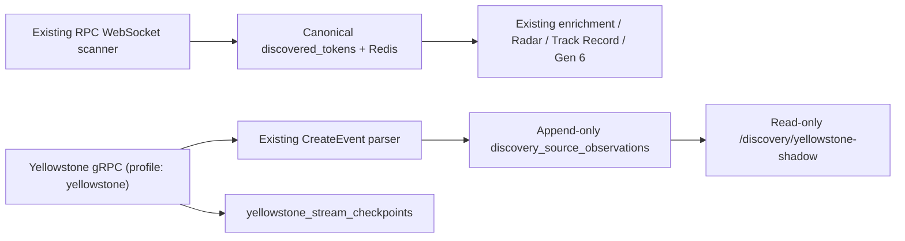

# MEMESCOPE Yellowstone Shadow Integration — Phase 1

**Date:** 2026-08-16  
**Scope:** Additive, non-authoritative Pump.fun Yellowstone/gRPC observation only.

## Result

The existing JSON-RPC WebSocket scanner remains MEMESCOPE's sole canonical discovery
writer. Yellowstone is a separate, profile-gated observer that writes only provenance
telemetry and recovery state. It cannot publish to Redis, create a `discovered_tokens`
row, trigger enrichment/Radar/Track Record/Paper Wallet work, or invoke Real Wallet.

## Architecture implemented

Both transports can emit `DiscoveryEvent`: mint, local receipt (`observed_at`), slot,
signature, source, program, event type, provider timestamp, ingestion timestamp,
replay/reconnect generation, and provider sequence. RPC telemetry is explicitly
best-effort and occurs only after the canonical scanner commit; a telemetry error is
caught and cannot undo that commit.

## Provider and safety configuration

New environment configuration is documented in `.env.example`, staging, production,
and Compose:

- `YELLOWSTONE_ENABLED=false` (default)
- `YELLOWSTONE_SHADOW_MODE=true` (required; non-shadow mode is rejected)
- `YELLOWSTONE_GRPC_URL=` and `YELLOWSTONE_X_TOKEN=` (required only when enabled)
- filtered confirmed transactions: `vote=false`, `failed=false`, Pump.fun only
- `YELLOWSTONE_REPLAY_OVERLAP_SLOTS=2`

The observer runs only under the optional Compose `yellowstone` profile and uses
`restart: on-failure`; it is not launched by default. The gRPC stubs are vendored from
`rpcpool/yellowstone-grpc` commit `ecdac262a500460e82aeaddbb1891ef002670bc7` with
`grpcio>=1.76.0` and `protobuf>=6.31.1` runtime dependencies.

## Data model and recovery

`discovery_source_observations` is an immutable, source-specific ledger with unique
`(source, signature, mint_address)`. It has no foreign key to canonical discovery, so
Yellowstone-only observations can be measured without changing `discovered_tokens` or
its historical `discovered_at` meaning.

`yellowstone_stream_checkpoints` retains the last *durably persisted parsed
observation* (slot/signature), separate last-received slot, connection status, errors,
and cumulative metrics. The checkpoint advances only in the same transaction as a new
ledger observation. On reconnect the observer asks `SubscribeReplayInfo`, requests a
small overlapping replay window, marks replayed observations, and relies on the ledger
unique key for idempotence. If provider retention cannot cover the checkpoint, it
records an error and does not silently skip forward.

`GET /api/v1/discovery/yellowstone-shadow` is a read-only ops view with connection
state, durable/received slots, counters, and source-overlap metrics: RPC-only,
Yellowstone-only, both, source-first counts, and signed p50/p95/p99 receipt deltas.
No latency advantage is claimed until live observations exist.

## Files and migrations

Primary additions are under `backend/app/services/discovery/`,
`backend/app/models/discovery.py`, `backend/app/repositories/discovery.py`, and
`backend/app/yellowstone_main.py`. The only canonical-scanner change is a post-commit,
exception-isolated RPC observation record.

Applied local additive migrations:

- `0033_yellowstone_shadow_ledger`
- `0034_yellowstone_shadow_metrics`

They create/add only telemetry/checkpoint structures; no token, Radar, Track Record,
Paper Wallet, or Real Wallet rows are rewritten or deleted.

## Verification

Focused integration coverage passed in the rebuilt backend image:

- **6 passed**: normalized/filter construction, malformed/non-create rejection,
  real CreateEvent parsing into shadow-only ledger, source overlap, idempotency, and
  replay overlap/checkpoint behavior with no canonical/Radar/Paper writes.
- `ruff check`: passed.
- `ruff format --check`: passed (8 authored files).
- `docker compose config --quiet`: passed.
- gRPC/protobuf import smoke test: passed (`grpcio 1.83.0`, `protobuf 7.35.1`).
- Alembic current: `0034_yellowstone_shadow_metrics (head)`.

No Yellowstone provider URL/token is configured, so no natural shadow stream was
started and there are no live observations or measured source deltas. Credentials were
neither requested nor fabricated. At verification time `YELLOWSTONE_ENABLED=false`,
shadow mode was true, and Real Wallet remained `execution=False`, `autotrade=False`.

## Cutover criteria (recommendation only)

Do not make Yellowstone primary in Phase 1. First collect at least 10,000 parsed
Pump.fun creation observations across seven uninterrupted days. Require no canonical
duplicates or downstream regression; a real replay/reconnect with no unexplained gap;
low, explained source-only cohorts; stable reconnect/error/duplicate rates; and a
material p50 **and** p95 source-receipt advantage. The absence of credentials and live
data blocks every latency, coverage, and primary-cutover conclusion.

RPC remains primary: YES
Yellowstone shadow enabled: NO
Safe to continue collecting shadow data: YES
Safe to make Yellowstone primary: NO
